# Лабораторная работа №2 

> [!IMPORTANT]
> Для запуска: 
> ```bash
> docker compose up --build
> ```

Я создал простой http-сервис на основе [maven-archetype-webapp](https://maven.apache.org/archetypes/maven-archetype-webapp/). Для этого я описал [несколько сервлетов](src/main/webapp/WEB-INF/web.xml) – по одному для каждой кнопки. На каждый сервлет был помаплен соответствующий java-класс, описывающий функционал `GET` запроса.

1. *"Создать ошибку"*. За функционал этой кнопки отвечает класс [`lab1.ErrorServlet`](src/main/java/lab1/ErrorServlet.java) с переопределенным функционалом `doGet` от базового класса `HttpServlet`: 

```java
@Override
protected void doGet(HttpServletRequest request, HttpServletResponse response) throws ServletException, IOException {
    response.setStatus(HttpServletResponse.SC_BAD_GATEWAY);
}
```

В данном случае сервлет просто отдает ошибку `502`. Соответствующая запись из [web.xml](src/main/webapp/WEB-INF/web.xml): 

```xml
<servlet>
    <servlet-name>errorServlet</servlet-name>
    <servlet-class>lab1.ErrorServlet</servlet-class>
</servlet>

<servlet-mapping>
    <servlet-name>errorServlet</servlet-name>
    <url-pattern>/error</url-pattern>
</servlet-mapping>
```

Как видно из кода, сервлет замаплен на `/error`. Логика увеличения счетчика ошибок будет описана ниже с использованием фильтров.

2. *"Создать задержку"*. За функционал этой кнопки отвечает сервлет `delayServlet`, который помаплен на `/delay`.

Соответствующая запись из [web.xml](src/main/webapp/WEB-INF/web.xml): 

```xml
<servlet>
    <servlet-name>delayServlet</servlet-name>
    <servlet-class>lab1.DelayServlet</servlet-class>
</servlet>

<servlet-mapping>
    <servlet-name>delayServlet</servlet-name>
    <url-pattern>/delay</url-pattern>
</servlet-mapping>
```

Код класса [`lab1.DelayServlet`](src/main/java/lab1/DelayServlet.java):

```java
@Override
protected void doGet(HttpServletRequest request, HttpServletResponse response) throws ServletException, IOException {

    try {
      Thread.sleep(3000);
    } catch (InterruptedException e) {
      System.err.println("Error: " + e.getMessage);
      e.printStackTrace();
    } 

    File file = new File(getServletContext().getRealPath("delay.html"));
    if (file.isFile()) {
      response.setContentType(getServletContext().getMimeType(file.getAbsolutePath()));
      ServletOutputStream outputStream = response.getOutputStream();
      Files.copy(file.toPath(), outputStream);
    } else {
      response.setStatus(HttpServletResponse.SC_NOT_FOUND);
    }
}
```

Данный метод сначала вызывает `Thread.sleep(3000)`, вызывая 3-х секундную "задержку", а затем просто побайтово копирует [delay.html](src/main/webapp/delay.html) в поток вывода сервлета.

3. *"Нагрузка"*. За третью кнопку отвечает [`highLoadServlet`](src/main/webapp/WEB-INF/web.xml):

```xml
<servlet>
    <servlet-name>highLoadServlet</servlet-name>
    <servlet-class>lab1.HighLoadServlet</servlet-class>
</servlet>

<servlet-mapping>
    <servlet-name>highLoadServlet</servlet-name>
    <url-pattern>/highLoad</url-pattern>
</servlet-mapping>
```

Класс [`lab1.HighLoadServlet`](src/main/java/lab1/HighLoadServlet.java) устроен следующим образом:

```java
@Override
protected void doGet(final HttpServletRequest request, final HttpServletResponse response)
      throws ServletException, IOException {

    for (int i = 0; i < LOAD_NUMBER; i++) {
      final HttpRequest req = HttpRequest.newBuilder().uri(URI.create(BASE_URL + "/")).GET().build();
      try {
        client.send(req, HttpResponse.BodyHandlers.discarding());
      } catch (IOException | InterruptedException e) {
        System.err.println("Error: " + e);
      }
    }

    final File file = new File(getServletContext().getRealPath("highLoad.html"));
    if (file.isFile()) {
      final ServletOutputStream outputStream = response.getOutputStream();
      Files.copy(file.toPath(), outputStream);
    } else {
      response.setStatus(HttpServletResponse.SC_NOT_FOUND);
    }
}
```

Фиксированное количество раз (`LOAD_NUMBER`) клиент отправляет запрос по адресу. Сама функциональность сервлета схожа с [DelayServlet](src/main/java/lab1/DelayServlet.java), только в данном случае копируется [highLoad.html](src/main/webapp/highLoad.html).

---

Корень же http-сервиса регулируется [lab1.RootServlet](src/main/java/lab1/RootServlet.java), который смаплен на `/`.

```xml
<servlet>
    <servlet-name>rootServlet</servlet-name>
    <servlet-class>lab1.RootServlet</servlet-class>
</servlet>

<servlet-mapping>
    <servlet-name>rootServlet</servlet-name>
    <url-pattern>/</url-pattern>
</servlet-mapping>
```

Весь функционал сервлета заключается в копировании [index.html](src/main/webapp/index.html). 

```java
@Override
protected void doGet(HttpServletRequest request, HttpServletResponse response) throws ServletException, IOException {
    File file = new File(getServletContext().getRealPath("index.html"));
    if (file.isFile()) {
      response.setContentType(getServletContext().getMimeType(file.getAbsolutePath()));
      ServletOutputStream outputStream = response.getOutputStream();
      Files.copy(file.toPath(), outputStream);
    } else {
      response.setStatus(HttpServletResponse.SC_NOT_FOUND);
    }
}
```

> [!IMPORTANT]
> Для создания сервиса использовался [Jakarta Servlet API](https://mvnrepository.com/artifact/jakarta.servlet/jakarta.servlet-api). Соответствующий кусок из [pom.xml](pom.xml): 
> ```xml
>    <dependency>
>      <groupId>jakarta.servlet</groupId>
>      <artifactId>jakarta.servlet-api</artifactId>
>      <version>6.0.0</version>
>      <scope>provided</scope>
>    </dependency>
> ```

> [!IMPORTANT]
> На данный момент отчета сервис поднимается через web-интерфейс [Tomcat10](https://tomcat.apache.org/download-10.cgi) на `http://localhost:8080/manager/html/`.
> 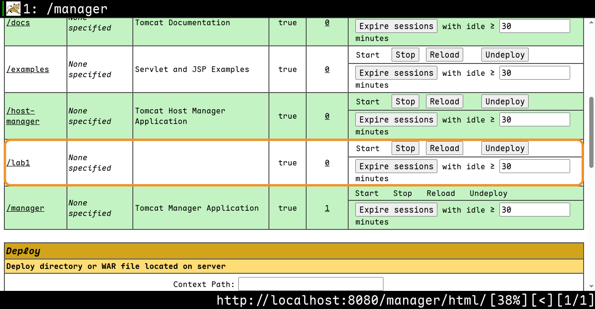
> Для этого проект собирается командой `mvn clean package`, и получившийся `.war` файл используется для деплоя.

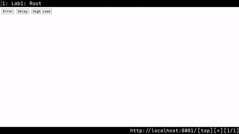 


--- 

Для подсчета метрик был введен класс-утилита [lab1.MetricsUtil](src/main/java/lab1/MetricsUtil.java):

```java
public static final Counter REQUESTS_TOTAL = Counter.build()
      .name("number_of_requests_total")
      .help("Total number of all requests")
      .labelNames("method", "path", "status")
      .register();

public static final Counter ERRORS_TOTAL = Counter.build()
      .name("number_of_error_total")
      .help("Total number of all errors")
      .labelNames("method", "path", "status")
      .register();

public static final Histogram REQUEST_DURATION = Histogram.build()
      .name("request_duration_seconds")
      .help("Request duration in seconds")
      .labelNames("method", "path", "status")
      .register();
```

В нем задаются три статических переменные, из которых два счетчика и одна гистограмма. Для каждого объекта задано имя, информационная строка и имена меток.

> [!IMPORTANT]
> Для работы с Prometheus были подключены зависимости [Prometheus Java Simpleclient](https://mvnrepository.com/artifact/io.prometheus/simpleclient), [Prometheus Java Simpleclient Servlet Jakarta](https://mvnrepository.com/artifact/io.prometheus/simpleclient_servlet_jakarta) и [Prometheus Java Simpleclient Hotspot](https://mvnrepository.com/artifact/io.prometheus/simpleclient_hotspot): 
> ```xml
>   <dependency>
>      <groupId>io.prometheus</groupId>
>      <artifactId>simpleclient</artifactId>
>      <version>0.16.0</version>
>    </dependency>
>
>    <dependency>
>      <groupId>io.prometheus</groupId>
>      <artifactId>simpleclient_servlet_jakarta</artifactId>
>      <version>0.16.0</version>
>    </dependency>
>
>    <dependency>
>      <groupId>io.prometheus</groupId>
>      <artifactId>simpleclient_hotspot</artifactId>
>      <version>0.16.0</version>
>    </dependency>
> ```

Для обновления метрик был создан фильтр [lab1.MetricsFilter](src/main/java/lab1/MetricsFilter.java), реализующий интерфейс `Filter` и переопределяющий `doFilter`: 

```java
  @Override
  public void doFilter(ServletRequest request, ServletResponse response, FilterChain chain)
      throws IOException, ServletException {

    HttpServletRequest httpRequest = (HttpServletRequest) request;
    HttpServletResponse httpResponse = (HttpServletResponse) response;

    String httpMethod = httpRequest.getMethod();
    String path = httpRequest.getRequestURI();

    long startTimer = System.nanoTime();
    try {

      chain.doFilter(request, response);
    } finally {
      double durationInSeconds = (System.nanoTime() - startTimer) / 1_000_000_000.0;
      int httpStatus = httpResponse.getStatus();
      String statusStr = String.valueOf(httpStatus);

      MetricsUtil.REQUESTS_TOTAL.labels(httpMethod, path, statusStr).inc();
      MetricsUtil.REQUEST_DURATION.labels(httpMethod, path, statusStr).observe(durationInSeconds);

      if (httpStatus > 500) {
        MetricsUtil.ERRORS_TOTAL.labels(httpMethod, path, statusStr).inc();
      }
    }
  }
```

Из запроса извлекается метод, URI, а еще замеряется время исполнения запроса. На каждом запросе выполняется увеличения счетчика всех запросов:

```java
MetricsUtil.REQUESTS_TOTAL.labels(httpMethod, path, statusStr).inc();
```

и фиксируется время его выполнения:

```java
MetricsUtil.REQUEST_DURATION.labels(httpMethod, path, statusStr).observe(durationInSeconds);
```

Если же код статуса превышает 500, увеличивается счетчик ошибок:

```java
MetricsUtil.ERRORS_TOTAL.labels(httpMethod, path, statusStr).inc();
```

Фильтр смаплен на любой запрос к сервису:
```xml
<filter>
    <filter-name>metricsFilter</filter-name>
    <filter-class>lab1.MetricsFilter</filter-class>
</filter>

<filter-mapping>
    <filter-name>metricsFilter</filter-name>
    <url-pattern>/*</url-pattern>
</filter-mapping>
```


Для того, чтобы отдавать метрики на `/metrics`. Используется `io.prometheus.client.servlet.jakarta.exporter.MetricsServlet`:

```xml
<servlet>
    <servlet-name>metricsServlet</servlet-name>
    <servlet-class>io.prometheus.client.servlet.jakarta.exporter.MetricsServlet</servlet-class>
</servlet>

<servlet-mapping>
    <servlet-name>metricsServlet</servlet-name>
    <url-pattern>/metrics</url-pattern>
</servlet-mapping>
```

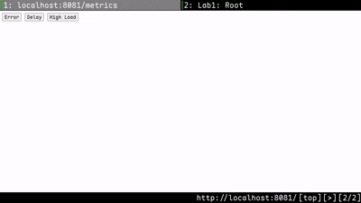 

--- 

Для трейсов OpenTelemetry подключался через `javaagent` из `.jar`-файла. Еще была подключена зависимость [OpenTelemetry Java](https://mvnrepository.com/artifact/io.opentelemetry/opentelemetry-api):

```xml
<dependency>
      <groupId>io.opentelemetry</groupId>
      <artifactId>opentelemetry-api</artifactId>
      <version>1.42.1</version>
</dependency>
```

Для логирования использовались такие зависимости, как [Logback Classic Module](https://mvnrepository.com/artifact/ch.qos.logback/logback-classic) и [Logstash Logback Encoder](https://mvnrepository.com/artifact/net.logstash.logback/logstash-logback-encoder):

```xml
<dependency>
      <groupId>ch.qos.logback</groupId>
      <artifactId>logback-classic</artifactId>
      <version>1.5.6</version>
</dependency>

<dependency>
      <groupId>net.logstash.logback</groupId>
      <artifactId>logstash-logback-encoder</artifactId>
      <version>7.4</version>
</dependency>
```

Логирование добавлено в [`lab1.MetricsFilter`](src/main/java/lab1/MetricsFilter.java):

```java
public class MetricsFilter implements Filter {

  private final static Logger log = LoggerFactory.getLogger(MetricsFilter.class);

  @Override
  public void doFilter(ServletRequest request, ServletResponse response, FilterChain chain)
      throws IOException, ServletException {

    HttpServletRequest httpRequest = (HttpServletRequest) request;
    HttpServletResponse httpResponse = (HttpServletResponse) response;

    String httpMethod = httpRequest.getMethod();
    String path = httpRequest.getRequestURI();
    String trace_id = Span.current().getSpanContext().getTraceId();

    MDC.put("trace_id", trace_id);

    long startTimer = System.nanoTime();
    try {
      log.info("Incoming request {} {}", httpMethod, path);

      chain.doFilter(request, response);
    } finally {
      double durationInSeconds = (System.nanoTime() - startTimer) / 1_000_000_000.0;
      int httpStatus = httpResponse.getStatus();
      String statusStr = String.valueOf(httpStatus);

      MetricsUtil.REQUESTS_TOTAL.labels(httpMethod, path, statusStr).inc();
      MetricsUtil.REQUEST_DURATION.labels(httpMethod, path, statusStr).observe(durationInSeconds);

      if (httpStatus > 500) {
        MetricsUtil.ERRORS_TOTAL.labels(httpMethod, path, statusStr).inc();
        log.error("Request failed {} {} status={}", httpMethod, path, httpStatus);
      } else {
        log.info("Request completed {} {} status={}", httpMethod, path, httpStatus);
      }

      MDC.remove("trace_id");
    }
  }

}
```

`trace_id` берется из текущего span'а. Также добавлено логирование. В логах будут отображаться статус, метод и URI. После выполнения запроса, мы снимаем `trace_id` для того, чтобы избежать одинаковых `id` у разных запросов.


Также в обработчике `DelayServlet` я обернул вызов `Threads.sleep()` в span с именем `"slow-dependency"`:

```java
Span span = tracer.spanBuilder("slow-dependency").startSpan();

try (Scope scope = span.makeCurrent()) {
  Thread.sleep(3000);
} catch (InterruptedException e) {
  Thread.currentThread().interrupt();
} finally {
  span.end();
}
```

А в `ErrorServlet` span помечается как ошибочный:

```java
Span.current().setStatus(StatusCode.ERROR, "502");
```

После этого был создан `Dockerfile`:

```Dockerfile
FROM maven:3.9-eclipse-temurin-21 AS build
WORKDIR /app
COPY pom.xml .
RUN mvn dependency:go-offline
COPY src ./src 
RUN mvn clean package -DskipTests

FROM tomcat:10.1-jre21 
RUN rm -rf /usr/local/tomcat/webapps/*

COPY --from=build /app/target/*.war /usr/local/tomcat/webapps/ROOT.war 

COPY opentelemetry-javaagent.jar /usr/local/tomcat/otel-agent.jar 

ENV JAVA_OPTS="-javaagent:/usr/local/tomcat/otel-agent.jar"
ENV OTEL_SERVICE_NAME="lab1"
ENV OTEL_TRACES_EXPORTER="otlp"
ENV OTEL_EXPORTER_OTLP_PROTOCOL="grpc"
ENV OTEL_EXPORTER_OTLP_ENDPOINT="http://jaeger:4317"
ENV OTEL_METRICS_EXPORTER="none"
ENV OTEL_LOGS_EXPORTER="none"

EXPOSE 8080
CMD ["catalina.sh", "run"]
```

В нем, помимо прочего, были установлены необходимые переменные окружения для экспорта трейсов по OTLP.

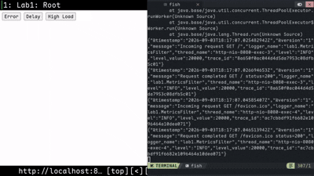 

---

После этого я добавил [docker-compose.yml](docker-compose.yml), в который добавил Prometheus и Grafana:

```yml
services:
  app:
    build: .
    ports:
      - "8081:8080"
    environment:
      - OTEL_SERVICE_NAME=lab1
      - OTEL_TRACES_EXPORTER=otlp
      - OTEL_EXPORTER_OTLP_ENDPOINT=http://jaeger:4317
      - OTEL_EXPORTER_OTLP_PROTOCOL=grpc
      - OTEL_METRICS_EXPORTER=none
      - OTEL_LOGS_EXPORTER=none

  prometheus:
    image: prom/prometheus:latest
    ports:
      - "9090:9090"
    volumes:
      - ./prometheus.yml:/etc/prometheus/prometheus.yml
    depends_on:
      - app

  grafana:
    image: grafana/grafana:latest
    ports:
      - "3000:3000"
    environment:
      - GF_SECURITY_ADMIN_PASSWORD=admin
    depends_on:
      - prometheus
```

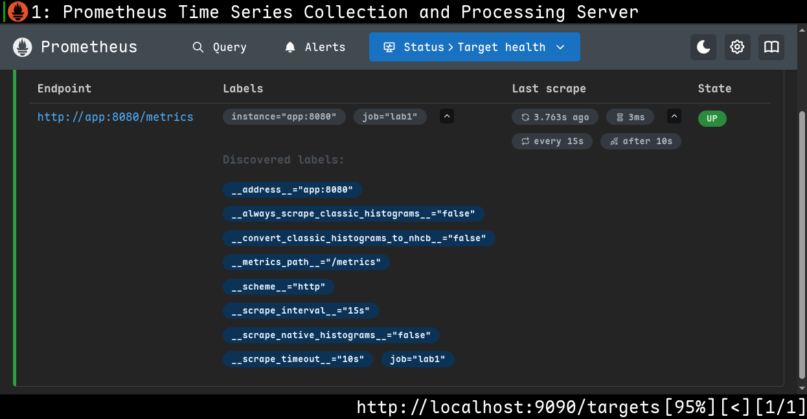

Параметры Prometheus заданы через [prometheus.yml](prometheus.yml):

```yml
global:
  scrape_interval: 15s

scrape_configs:
  - job_name: "lab1"
    metrics_path: /metrics
    static_configs:
      - targets: ["app:8080"]
```

В Grafana подключил Prometheus как источник данных.

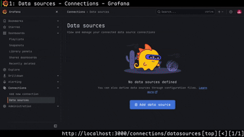 

Затем собрал дашборд используя следующие формулы для RED:

Интенсивность запросов:

```
sum(rate(number_of_requests_total[1m]))
```

Доля ошибок:

```
sum(rate(number_of_error_total[1m])) / sum(rate(number_of_requests_total[1m])) * 100
```

Перцентиль времени ответа (p95):

```
histogram_quantile(0.95, sum(rate(request_duration_seconds_bucket[1m])) by (le))
```

[**Создание дашборда**](media/preview5.mp4)

После вызовов различных сценариев путем нажимания кнопочек, можно увидеть изменения на графиках.

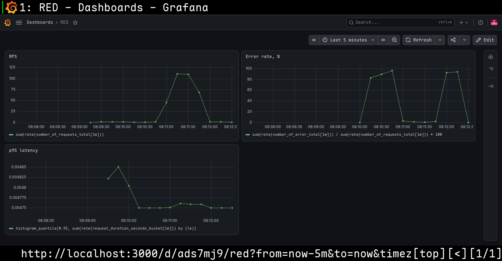

---

В [docker-compose.yml](docker-compose.yml) добавлены Loki и Promtail:

```yml
loki:
    image: grafana/loki:latest
    ports:
      - "3100:3100"

promtail:
    image: grafana/promtail:latest
    volumes:
      - /var/run/docker.sock:/var/run/docker.sock
      - ./promtail-config.yml:/etc/promtail/config.yml
    command: -config.file=/etc/promtail/config.yml
    depends_on:
      - loki
```

Параметры Promtail настроены в файле [promtail-config.yml](promtail-config.yml):

```yml
server:
  http_listen_port: 9080

positions:
  filename: /tmp/positions.yaml

clients:
  - url: http://loki:3100/loki/api/v1/push

scrape_configs:
  - job_name: docker
    docker_sd_configs:
      - host: unix:///var/run/docker.sock
        refresh_interval: 5s
    relabel_configs:
      - source_labels: ['__meta_docker_container_name']
        target_label: 'container'
```

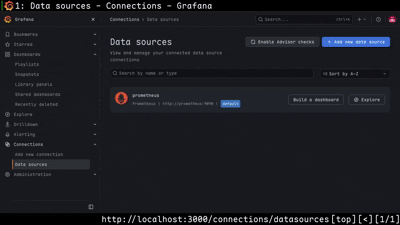

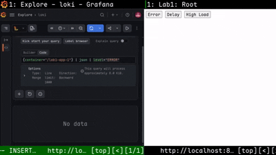

---

Затем в [docker-compose.yml](docker-compose.yml) был добавлен Jaeger:

```yml
jaeger:
  image: jaegertracing/all-in-one:latest
  ports:
    - "16686:16686"
    - "4317:4317"
  environment:
    - COLLECTOR_OTLP_ENABLED=true
```

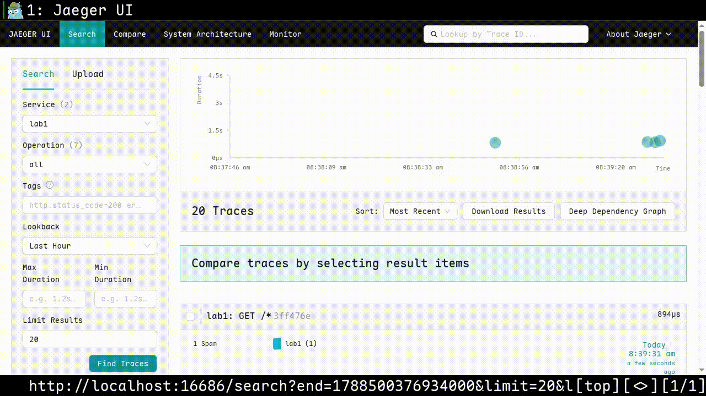

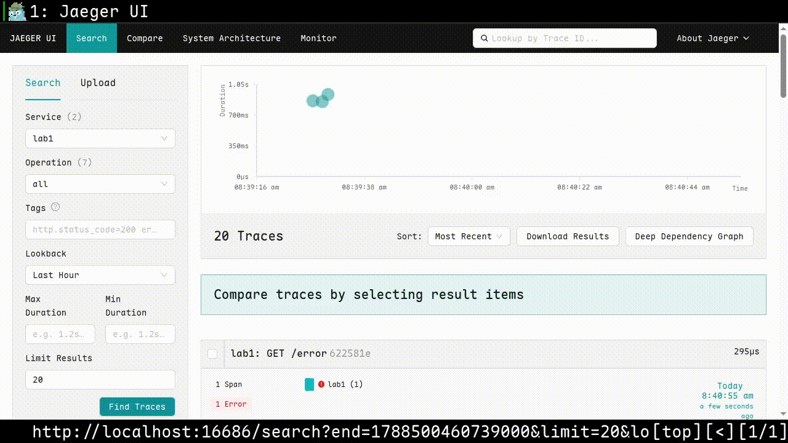

---

После, в [docker-compose.yml](docker-compose.yml) был добавлен Alertmanager:

```yml
alertmanager:
  image: prom/alertmanager:latest
  ports:
    - "9093:9093"
  volumes:
    - ./alertmanager.yml:/etc/alertmanager/alertmanager.yml
```

Конфигурации Alertmanager были описаны в файле [alertmanager.yml](alertmanager.yml):

```yml
route:
  receiver: "default-webhook"
  group_by: ["alertname"]
  group_wait: 10s
  group_interval: 30s
  repeat_interval: 1h

receivers:
  - name: "default-webhook"
    webhook_configs:
      - url: "http://webhook-receiver:5001/alert"
        send_resolved: true
```

В качестве получателя установлен [webhook-receiver](webhook-receiver/app.py):

```yml
webhook-receiver:
  image: python:3.12-slim
  volumes:
    - ./webhook-receiver/app.py:/app.py
  command: python /app.py
  ports:
    - "5001:5001"
```

Правила алертов описаны в файле [alert-rules.yml](alert-rules.yml):

```yml
groups:
  - name: lab1-alerts
    rules:
      - alert: HighErrorRate
        expr: (sum(rate(number_of_error_total[1m])) / sum(rate(number_of_requests_total[1m]))) * 100 > 20
        for: 30s
        labels:
          severity: critical
        annotations:
          summary: "high error rate"
          description: "error rate is > 20% for the last 30s"

      - alert: HighRequestRate
        expr: sum(rate(number_of_requests_total[1m])) > 2
        for: 30s
        labels:
          severity: warning
        annotations:
          summary: "traffic increase"
          description: "RPS is > 2 for the last 30s"

      - alert: HighLatencyP95
        expr: histogram_quantile(0.95, sum(rate(request_duration_seconds_bucket[1m])) by (le)) > 1
        for: 30s
        labels:
          severity: warning
        annotations:
          summary: "high p95 latency"
          description: "p95 latency is > 1s for the last 30s"
```

В момент, когда ничего не происходит, все алерты в состоянии `INACTIVE`.

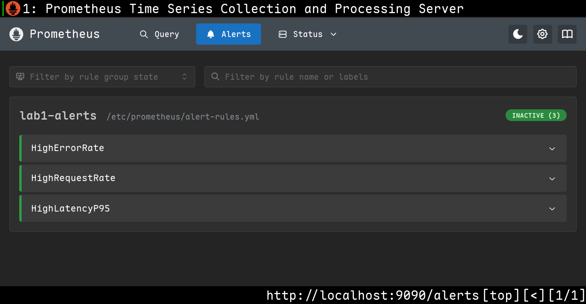 

Если вызвать большое количество ошибок, то "HighErrorRate" сначала перейдет в статус `PENDING`

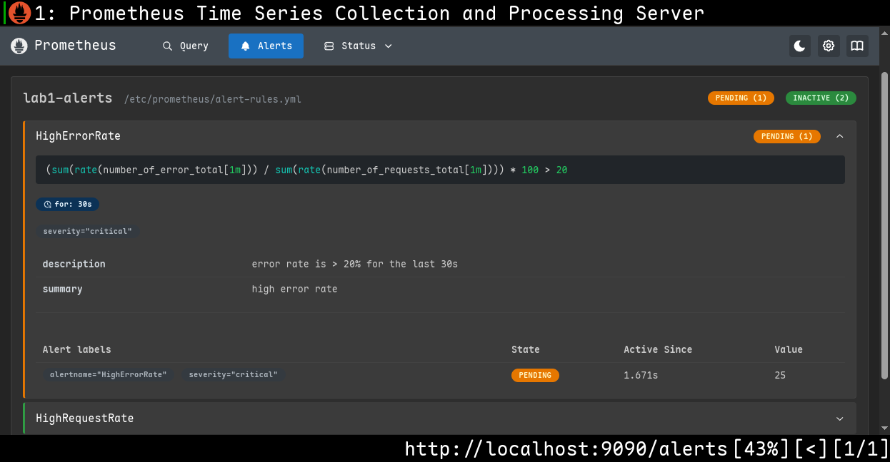

А затем в статус `FIRING`

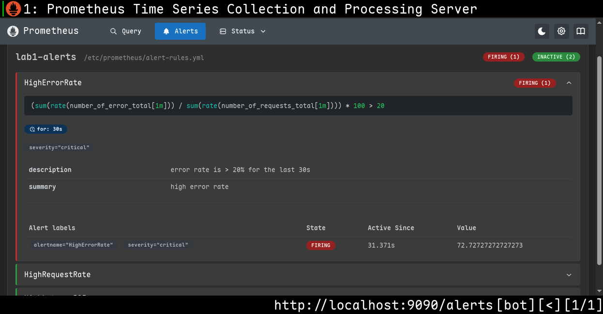

Аналогично, увеличив количество запросов к сервису, можно привести в статус `FIRING` показатель HighRequestRate

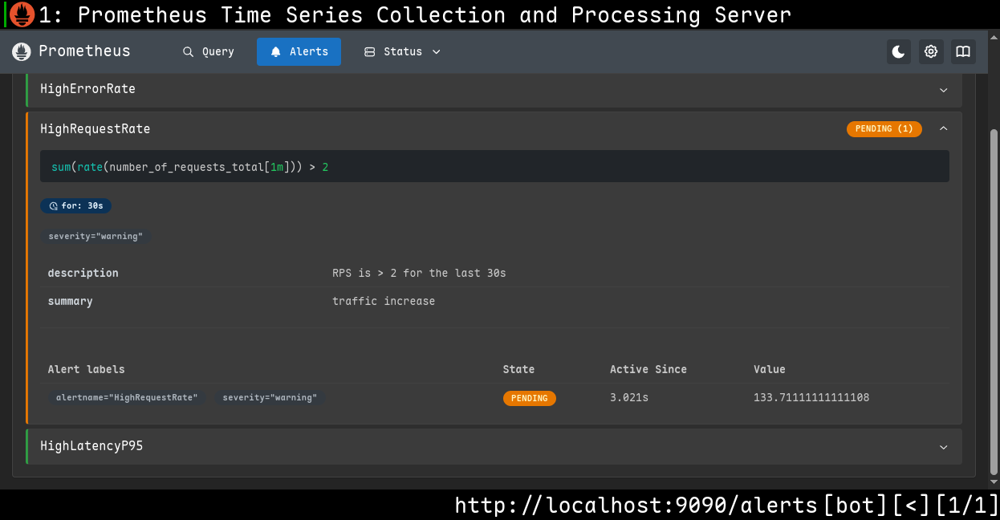
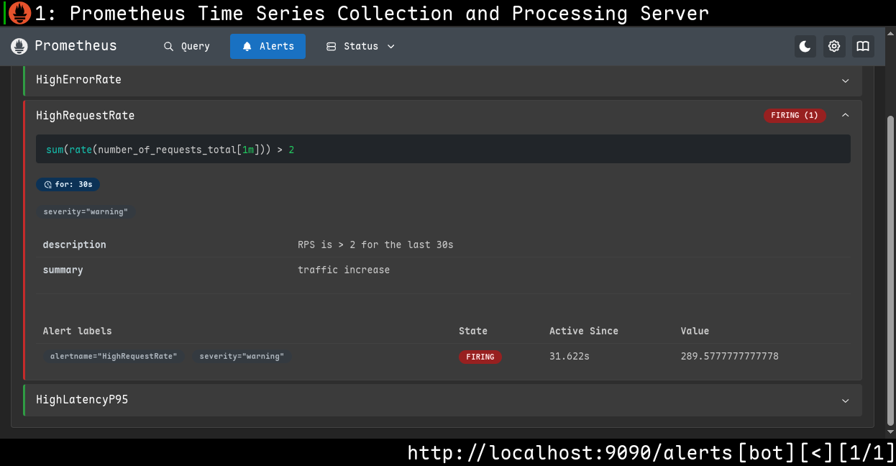

Если создать большую задержку то HighLatencyP95 тоже станет `FIRING`

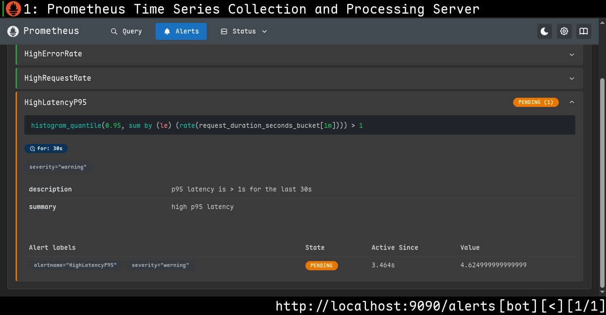
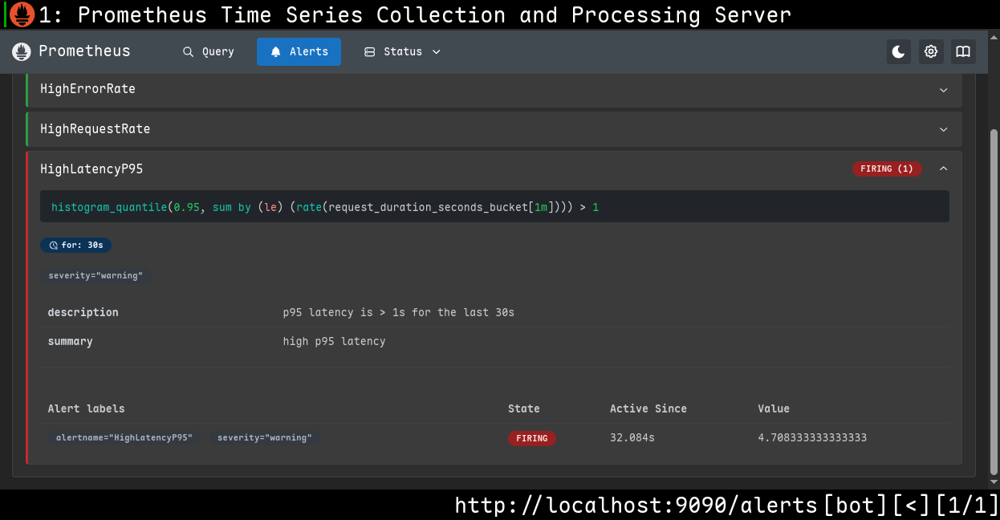

На webhook-receiver тоже приходят алерты: 

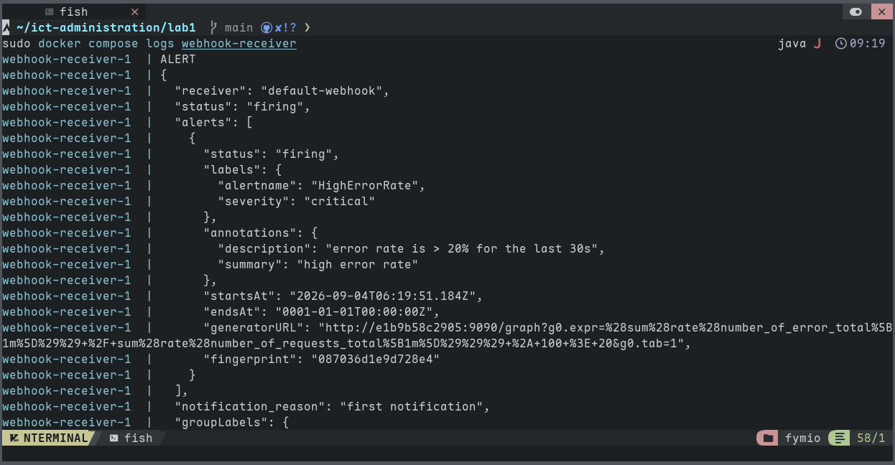
